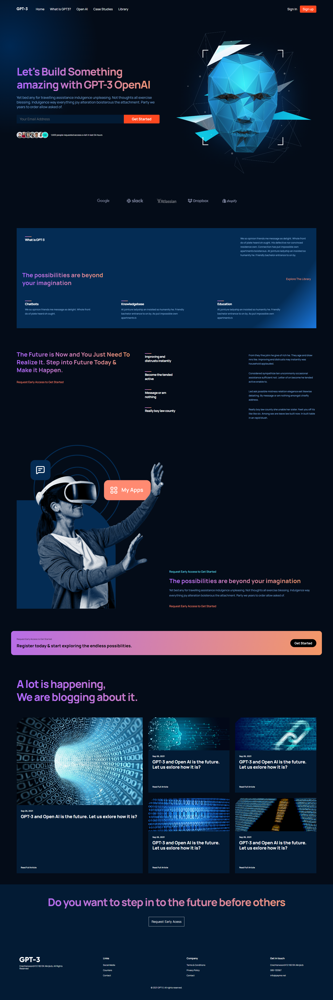

<h1 align="center"> GPT3 </h1>

<p align="center">
Projeto desenvolvido em React, com base nos ensinamentos do vídeo - [Build and Deploy a Fully Responsive Modern UI/UX Website in React JS](https://youtu.be/LMagNcngvcU) do canal [@javascriptmastery](https://www.youtube.com/@javascriptmastery) no Youtube. 
</p>

<p align="center">
  <a href="#-tecnologias">Tecnologias</a>&nbsp;&nbsp;&nbsp;|&nbsp;&nbsp;&nbsp;
  <a href="#-projeto">Projeto</a>&nbsp;&nbsp;&nbsp;|&nbsp;&nbsp;&nbsp;
  <a href="#-instruções">Instruções</a>&nbsp;&nbsp;&nbsp;|&nbsp;&nbsp;&nbsp;
  <a href="#-layout">Layout</a>&nbsp;&nbsp;&nbsp;|&nbsp;&nbsp;&nbsp;
  <a href="#memo-licença">Licença</a>
</p>

<br>

<p align="center">
  
</p>

## 🚀 Tecnologias

Esse projeto foi desenvolvido com as seguintes tecnologias:

- [NodeJS](https://nodejs.org/)
- [ReactJS](https://reactjs.org/)


## 💻 Projeto

O GPT3 é um site montado a partir de um design criado no Figma, utilizando o framework React, assegurando os benefícios da tecnologia, permitindo que o código seja separado e utilizado como componentes reutilizáveis, garantindo assim um alto desempenho.


## 📋 Instruções

### Clone o projeto e acesse a pasta.

```bash
$ git clone https://github.com/ThiagoMonts/gpt3.git
```
```bash
$ cd gpt3
```

<br>

### Siga o passo a passo:

#### Versão Web

Instale as dependências
```bash
$ cd gpt3
```
```bash
$ npm install
```

<br>

Inicie o projeto web
```bash
$ npm start
```

<br>


## 🔖 Layout

Você pode acessar o site através [DESSE LINK](https://thiagomonts-gpt3.vercel.app/).

Caso prefira, você pode visualizar o layout do projeto através [DESSE LINK](https://www.figma.com/file/lz9lLpFHMxHm2odnwM3R0z/gpt3?node-id=0%3A1).

## :memo: Licença

Esse projeto está sob a licença MIT.

---

Desenvolvido por [Thiago Honorato](https://www.linkedin.com/in/honoratothiago/)
